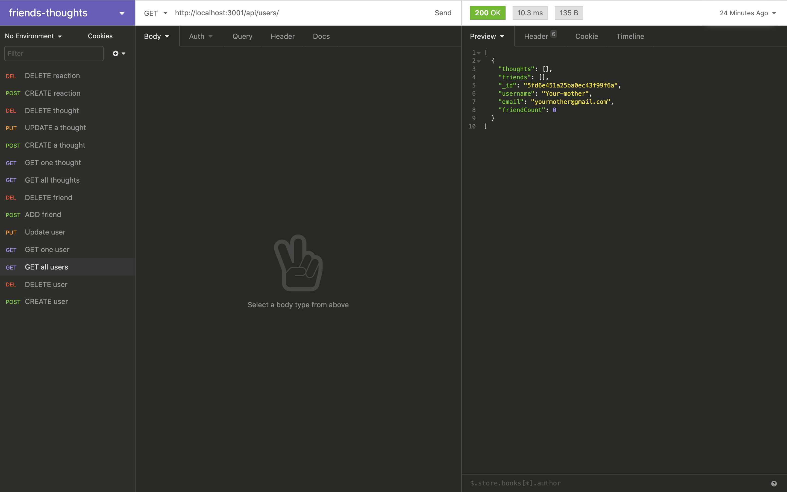

# friends-Thoughts API
## Summary
 For this project, I built an API on the backend for a social network web application. This project allows users and friends to react to each others thoughts and create a list of friends.

## Languages and npm packages
> 1. JavaScript
> 2. MongoDB
> 3. Mongoose
> 4. node
> 5. express

## Installation
> 1. Clone repo
> 2. command line run npm install
> 3. Type npm start to run server
> 4. server is connected to localhost:3001, run routes in insomnia core for testing

## Screenshot 

## Walk through
